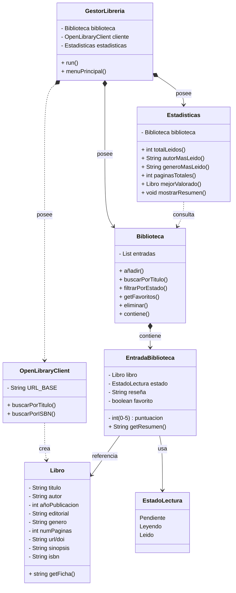

## Nombre del proyecto

Gestor de Librería Personal
---

## Descripción

*(Dos o tres frases explicando qué hace la aplicación y para quién es útil)*

---

## API utilizada

| Campo | Detalle |
|---|---|
| Nombre | OpenLibrary |
| URL base | https://openlibrary.org/developers |
| Documentación | |
| Autenticación requerida | No |
| Formato de respuesta | JSON |

---

## Endpoints que voy a usar

| Endpoint | Descripción | Ejemplo de llamada |
|---|---|---|
| `/ruta/del/endpoint` | Qué devuelve | `https://...` |

---

## Funcionalidades principales

Lista las cosas que hará tu aplicación. Empieza por lo más simple.

- [ ] Buscar libro: por título o por ISBN
- [ ] Ver la biblioteca entera
- [ ] Filtrar por estado (leído / leyendo / pendiente)
- [ ] Ver favoritos
- [ ] Editar estado, puntuación o reseña
- [ ] Ver estadísticas de lectura

---

## Clases previstas

| Clase | Responsabilidad |
|---|---|
| `Libro` | Representa un libro con todos sus datos 
| `EstadoLectura` | Representa el estado de lectura de un libro en la biblioteca |
| `EntradaBiblioteca` | Representa un libro dentro de la biblioteca personal del usuario, con su estado de lectura, puntuación y reseña |
| `Biblioteca` | Gestiona la colección de libros del usuario | 
| `OpenLibraryClient` | Clase responsable de hacer las llamadas API |
| `Estadísticas` | Calcula y muestra estadísticas de lectura sobre la biblioteca |
| `GestorLibreria` | Clase principal. Gestiona el menú |

---

## Diagrama de clases UML



---

## Ejemplo de respuesta JSON de la API

*(Pega aquí un fragmento real de la respuesta de la API para el endpoint principal)*

```json
{
  "ejemplo": "pega aquí la respuesta real"
}
```

---

## Dudas o decisiones pendientes

Security
Status
Comm
