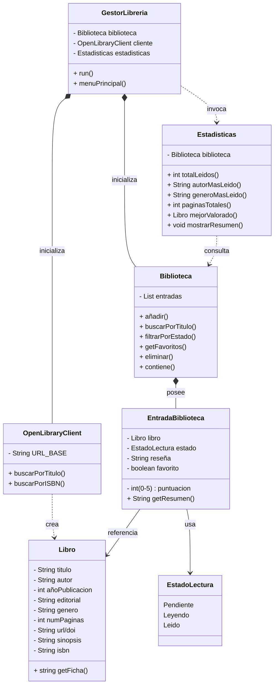

## PROYECTO: Gestor de Librería Personal
---

## Descripción

Esta aplicación permite a los usuarios organizar su colección de libros, permitiendo así diferenciar entre la información de la obra y la experiencia personal del lector. Es una herramienta ideal para bibliófilos que deseen llevar un registro detallado de sus lecturas, puntuaciones y estadísticas de progreso, integrando datos globales mediante una API externa.

---

## API utilizada

| Campo | Detalle |
|---|---|
| Nombre | OpenLibrary |
| URL base | https://openlibrary.org |
| Documentación | [OpenLibrary Search API](https://openlibrary.org/dev/docs/api/search) |
| Autenticación requerida | No |
| Formato de respuesta | JSON |

---

## Endpoints que voy a usar

| Endpoint | Descripción | Ejemplo de llamada |
|---|---|---|
| `/search.json?q=` | Búsqueda general por título, autor o ISBN | `https://openlibrary.org/search.json?q=the+hobbit` |
| `/search.json?isbn=` | Búsqueda específica por código de barras (ISBN) | `https://openlibrary.org/search.json?isbn=9780261102217` |
| `/authors/{key}.json` | Obtener detalles específicos de un autor | `https://openlibrary.org/authors/OL23919A.json` |


---

## Funcionalidades principales

Lista las cosas que hará tu aplicación. Empieza por lo más simple.

- [ ] **Buscar libro:** consulta por título o ISBN.
- [ ] **Gestión de Biblioteca:** Añadir libros encontrados a la biblioteca personal.
- [ ] **Seguimiento de Lectura:** Cambiar estado (Pendiente/Leyendo/Leído).
- [ ] **Personalización:** Añadir notas, reseñas y puntuación (0-5 estrellas).
- [ ] **Favoritos:** Marcar libros destacados para acceso rápido.
- [ ] **Estadísticas:** Visualizar total de páginas leídas, autor favorito y géneros más frecuentes.

---

## Clases previstas

| Clase | Responsabilidad |
|---|---|
| `Libro` | Objeto que contiene la información técnica y pública del libro |
| `EstadoLectura` | Enum que restringe los estados posibles: PENDIENTE, LEYENDO, LEIDO |
| `EntradaBiblioteca` | Clase que vincula un Libro con datos privados del usuario (reseña, nota) |
| `Biblioteca` | Contenedor principal que gestiona la lista de entradas y realiza filtros/búsquedas locales | 
| `OpenLibraryClient` | Clase responsable de hacer las llamadas API |
| `Estadísticas` | Calcula y muestra estadísticas de lectura sobre la biblioteca |
| `GestorLibreria` | Controlador que gestiona la interfaz de usuario y el flujo de la aplicación |

---

## Diagrama de clases UML



---

## Ejemplo de respuesta JSON de la API

```json
{
    "numFound" : 1,
    "docs" : [
    {
        "title" : "The Hobbit",
        "author_name" : ["J.R.R. Tolkien"],
        "first_publish_year" : 1937,
        "isbn" : ["9780261102217"],
        "number_of_pages_median" : 310,
        "publisher" : ["HarperCollins"],
        "language" : ["eng"]
    }
  ]
}
```

---

## Dudas o decisiones pendientes

